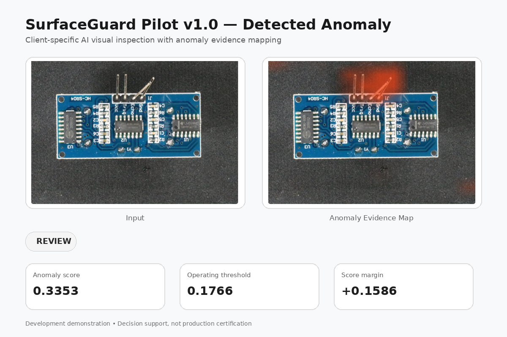
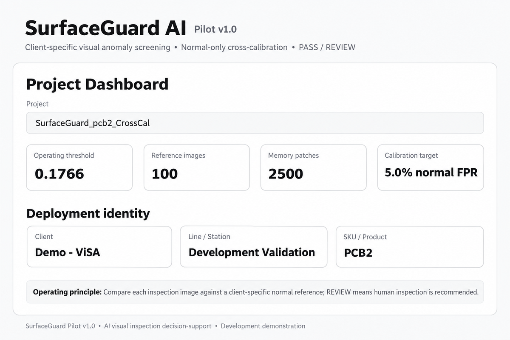
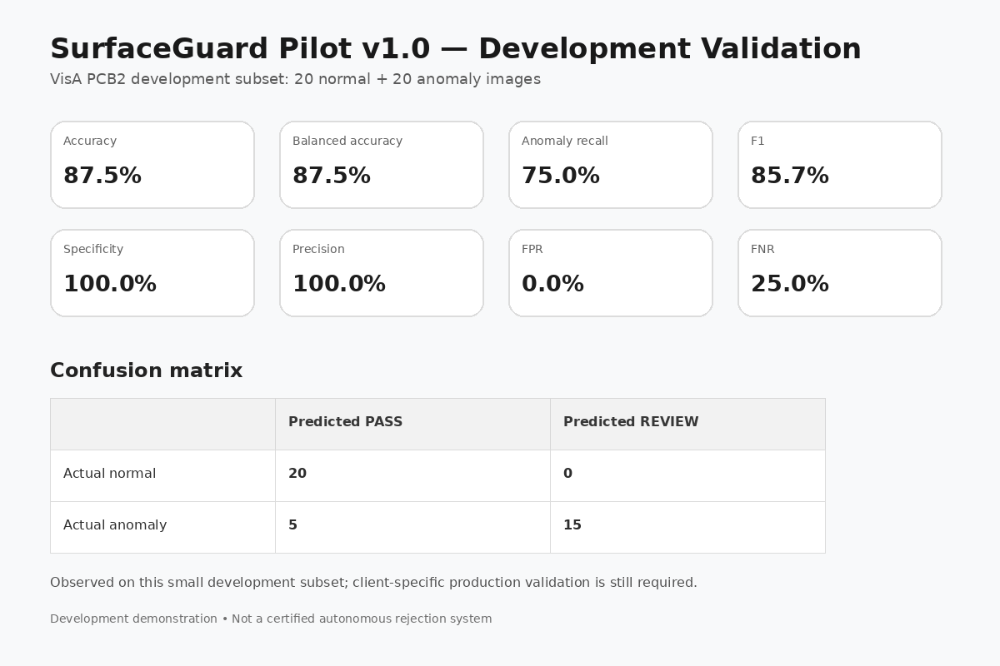

# SurfaceGuard AI — Visual Inspection Pilot

**Client-specific AI visual anomaly inspection for industrial quality control.**

SurfaceGuard AI is a visual inspection pilot designed for manufacturing scenarios where many examples of acceptable products may be available, while labeled examples of every possible defect are limited or unavailable.

Instead of requiring a large defect-classification dataset, the system builds a client-specific reference from normal product images and flags unusual visual patterns for human review.
## Visual Demonstration

### Detected Anomaly

### System Dashboard

### Validation Results

## What SurfaceGuard Does

- Normal-reference calibration
- PASS / REVIEW inspection decisions
- Image-level anomaly scoring
- Anomaly Evidence Maps
- Batch image inspection
- False-positive and false-negative analysis
- Automated validation and reporting
- Client-specific operating-threshold calibration

## Technical Approach

The current pilot uses:

- Python
- PyTorch
- ResNet-18 feature representations
- Patch-level visual embeddings
- Memory-bank-based anomaly comparison
- Cosine-distance anomaly scoring
- Top-k score aggregation
- Normal-only cross-calibration
- Streamlit interface for inspection and validation

The system is designed as an AI-assisted decision-support tool rather than an autonomous production rejection system.

## Development Demonstration

A development demonstration was conducted using a small subset of the **VisA PCB2** dataset:

| Metric | Result |
|---|---:|
| Images | 40 |
| Normal images | 20 |
| Anomalous images | 20 |
| Accuracy | 87.5% |
| Balanced Accuracy | 87.5% |
| Anomaly Recall | 75.0% |
| Precision | 100.0% |
| F1 Score | 85.7% |
| Specificity | 100.0% |

Confusion matrix:

- True Normal: 20
- False Review: 0
- Correctly Detected Anomalies: 15
- Missed Anomalies: 5

These results are from a **small development validation subset** and should not be interpreted as production-level performance guarantees.

## Deployment Philosophy

SurfaceGuard is calibrated for a specific inspection scenario, typically defined by:

- Product / SKU
- Camera
- Lighting
- Background
- Fixture
- Image acquisition conditions

Changes to these conditions can introduce domain shift and may require recalibration or a separate inspection scenario.

A real industrial deployment therefore requires validation using representative images from the actual production environment.

## Explainability

SurfaceGuard provides an **Anomaly Evidence Map** to highlight image regions that contribute to unusual visual patterns.

The evidence map is intended to support human inspection and model interpretation. It should not be treated as pixel-accurate defect segmentation.

## Intended Use

SurfaceGuard is designed for applications such as:

- Industrial visual inspection
- Manufacturing quality control
- Electronics inspection
- Component anomaly screening
- AI inspection feasibility studies
- Computer vision pilot projects

## Important Limitations

SurfaceGuard Pilot v1.0 is a feasibility and decision-support system.

It is **not**:

- A certified industrial safety system
- A production-ready autonomous reject mechanism
- A replacement for final human quality-control decisions
- Guaranteed to detect every possible defect

Production use requires additional validation, monitoring, and integration testing.

## Repository Scope

This repository is a **public project showcase**.

The commercial application source code, trained project artifacts, memory banks, client configurations, and deployment files are **not included** in this repository.

## Dataset Attribution

Demo imagery uses samples from the **VisA dataset** introduced by Zou et al., ECCV 2022.

VisA is distributed under the **Creative Commons Attribution 4.0 International (CC BY 4.0)** license.

Presentation graphics and layouts used in the SurfaceGuard demonstration were modified for this project.

## Author

**Marwan Al Zawahra**  
AI Researcher / Computer Vision Engineer

Research and development interests include:

- Computer Vision
- Anomaly Detection
- Weakly Supervised Learning
- Domain Generalization
- Industrial AI
- Reliable AI Systems

---

**SurfaceGuard AI — from anomaly-detection research to practical visual inspection.**
